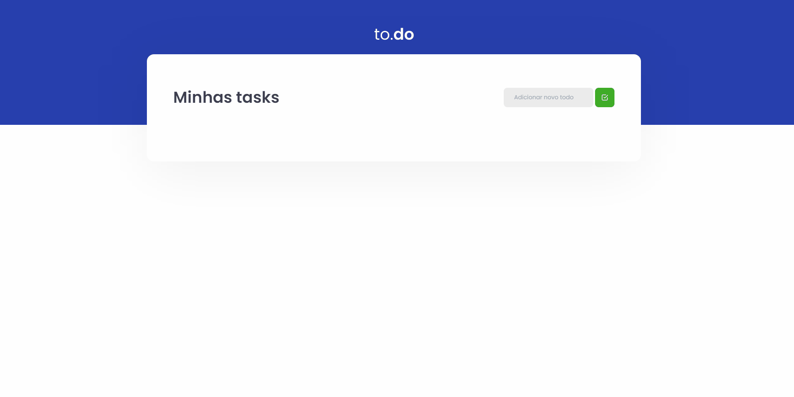

<p align="center">
 <a href="#about">Sobre o Projeto</a> •
 <a href="#technologies">Tecnologias</a> • 
 <a href="#installation">Como usar</a> • 
 <a href="#contribuicao">Contribuição</a> • 
 <a href="#licenc-a">Licença</a> • 
 <a href="#autor">Autor</a>
</p>

<h1 align="center" id="about">ToDo - TaskList</h1>
<p align="center">🚀 Este é um projeto desenvolvido durante o bootcamp Ignite, com o intuito de praticar os conceitos de Estado no React</p>

<h1 align="center" id="installation">Instalação</h1>
```bash
# Clone este repositório
$ git clone <https://github.com/GabrielTurra/Ignite-01-Conceitos-Do-React>

# Acesse a pasta do projeto no terminal/cmd
$ cd Ignite-01-Conceitos-Do-React

# Inicia a aplicação React
$ yarn dev

# O servidor inciará na porta:8080 - acesse <http://localhost:8080> 
